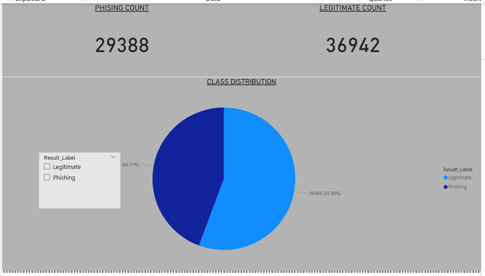
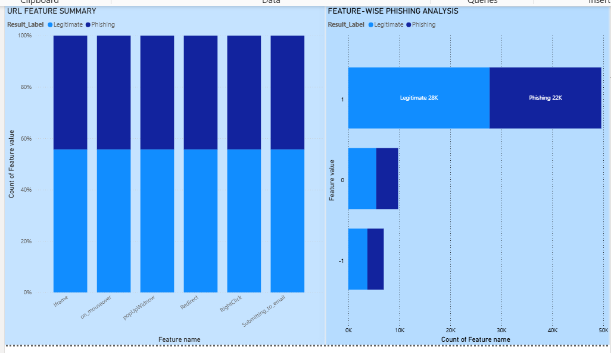
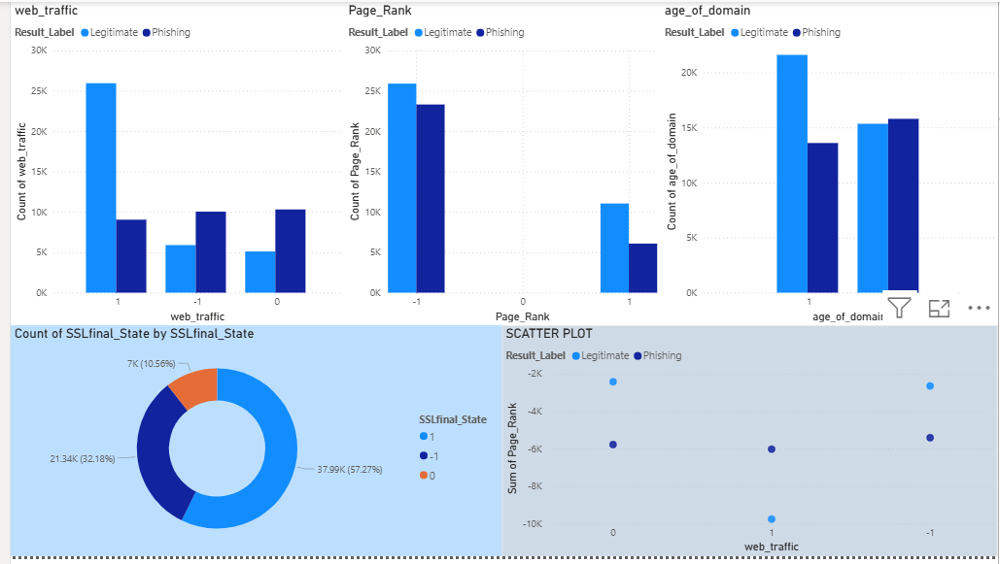
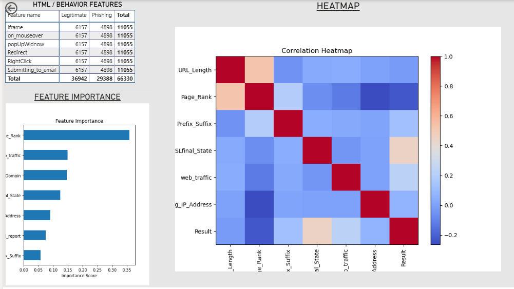

# 📊 Phishing Website Detection Dashboard (Power BI)

## 📌 Project Overview
This project presents an interactive Power BI dashboard to analyze phishing vs legitimate websites using various features like URL length, SSL state, page rank, and web traffic.

---
 
---

## 🎯 Objectives
- Analyze phishing vs legitimate websites  
- Understand feature impact  
- Visualize data using dashboards  
- Extract meaningful insights  

---

## 🛠️ Tools Used
- Power BI  
- Data Visualization  
- Data Analysis  

---

## 📊 Dashboard Preview

### 🔹 Main Dashboard

   
  <em>Overview of phishing vs legitimate websites</em>

### 🔹 Feature-wise Analysis

   
  <em>Comparison of features</em>

### 🔹 Traffic & Domain Insights

   
  <em>Web traffic, page rank, and domain age</em>

### 🔹 Correlation & Heatmap

   
  <em>Feature correlation and importance</em>

---

📥 [Download PBIX File](./powerbi-dashboard.pbix)

---

## 📈 Key Insights
- Legitimate websites are more than phishing  
- URL length and SSL state are important factors  
- Heatmap shows feature relationships  
- Feature importance highlights key indicators  

---

## 🚀 How to Use
1. Download the `.pbix` file  
2. Open in Power BI Desktop  
3. Explore dashboard  

---

## 👩‍💻 Author
Ipshita Tewary
